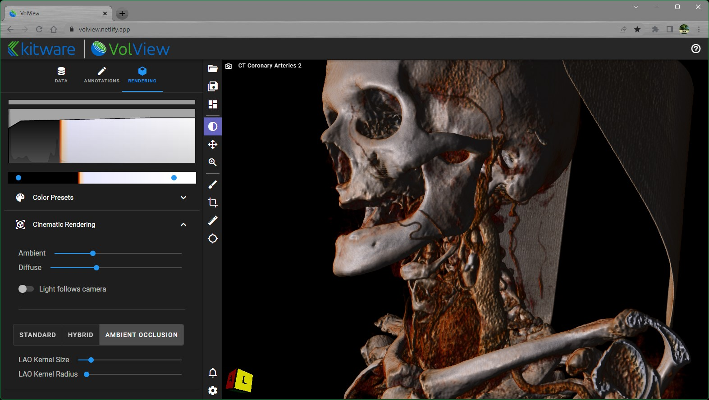

# Quick Start Guide

The Welcome screen for VolView is annotated in the image shown below. More information on the components of the welcome screen is provided in the ["Welcome Screen"](welcome_screen.html) documentation.

Starting from the welcome screen, there are four simple constructs needed to generate stunning and insightful visualizations from DICOM data.

1. Loading data
2. Radiological controls
3. Rendering controls
4. Saving / loading state

## 1. Loading Data

VolView accepts DICOM data in a vareity of formats:

- Folders: where a folder contains multiple DICOM objects (files)
- Selections of files: a selection of multiple DICOM files
- Zipped collections: containing a folder or selection of DICOM files

From the Data tab (default tab when VolView is started) you can drag-and-drop DICOM data in any of the above formats or you can click to bring up a file browser and select your DICOM data. You can also select one of the sample DICOM collections listed, and it will be downloaded onto your machine from [https://data.kitware.com](https://data.kitware.com/#collection/586fef9f8d777f05f44a5c86/folder/634713cf11dab81428208e1e).

[**_Watch the video!_**](https://youtu.be/4PvZd7yTzf0)

VolView can also load many other image data formats. To learn more, see the documentation on ["Loading Data"](loading_data.html).

**Note:** When new data has been loaded or when switching between tabs there may be a delay of up to 10 second before VolView displays the new data / tab.

## 2. Radiological controls

The three main radiological controls are as following:

- Layout: This toolbar button is illustrated below. Use it to choose between different window arrangements. Each view can display a different dataset, and you can switch the view type (2D slice, 3D volume, or oblique) using the dropdown in each view. 

- 2D Left mouse button: Window / Level, Pan, Zoom, or Crosshairs: Select these options to control the function of the left mouse button in the 2D windows. 

- 2D Annotations: Paint and Ruler: When the ruler tool selected, the left mouse button is used to place and adjust ruler end-markers. Right clicking on a end-marker displays a pop-up menu for deleting that ruler. Switch to the "Annotations" tab to see a list of annotations made to currently loaded data. Select the location icon next to a listed ruler to jump to its slice. Select the trashcan to delete that ruler. When the paint tool is selected, you can paint in any 2D window. Click on the paint tool a second time to bring up a menu of colors and adjust the brush size. Note: Segment groups and measurements are only visible in the UI when their associated base image's view is selected. 

- 3D Crop: Select this tool to adjust the extent of data shown in the 3D rendering. In the 3D window you can pick and move the corner, edge, and side markers to make adjustments. In the 2D windows, grab and move the edges of the bounding box overlaid on the data. 

[**_Watch the video!_**](https://youtu.be/Bj4ijh_VLUQ)

For information on the toolbar, see the documentation on ["Mouse controls"](mouse_controls.html) and ["Toolbar controls"](toolbar.html).

## 3. Rendering controls

VolView reads the DICOM tags of your data to determine appropriate preset parameter values for cinematic volume rendering for your data, but often you will want to tweak those presets to emphasize specific details. We recommend the following sequence of tweaks to improve your visualizations.

1. Cinematic volume rendering involves two "transfer functions": one maps the recorded intensity values (e.g., CT hounsfield units) to opacity and the other maps recorded intensity values to color. Both can be adjusted using the controls at the top of the Rendering tab. The graph at the top shows a histogram of the recorded intensity values in light gray and the current opacity transfer function as an overlaid curve in black. In that graph, beneath the black curve, is a depiction of the color transfer function. 
   a. Begin by adjusting the opacity transfer function by a press-and-drag right/left on the top graph. 
   b. Then adjust the color transfer function by moving the blue dots on the colorbar beneath the graph. 

2. You may decide that the colormaps and/or transfer function aren't suitable for your data. Click on the "Presets" bar to expand and show the available presets that offer alternative opacity and color transfer functions. 
3. Next, the lighting can be controlled.  
   a. Ambient lighting is the general brightness of the scene.  
   b. Diffuse lighting controls how the light reflects off the data. It is influenced by the position of the light relative to the orientation of the data's local surface.
   c. Light-follows-camera can be enabled / disabled to create shadows that highlights details within the data. When enabled, the light will be positioned in-line with the camera. When disabled, the last position of the light stays fixed relative to the data, even if the camera is moved. With light-follows-camera enabled, here is a view when the light is following the camera:  By moving the camera (and thereby the light) to the front of the data and then disabling light-follows-camera, the view should look light this:  Then moving back to the side view will show shadows that emphasize depth and details: 

4. Advanced, you can also explore alternative cinematic rendering methods. Detailed documentation will soon follow that describes these methods and demonstrates their utility for various types of medical data.
   a. Standard
   b. Hybrid
   c. Ambient Occlusion

[**_Watch the video!_**](https://youtu.be/eyrGd-meg6I)

## 4. Saving / loading state

Once you have made the measures and generated the visualizations that you want to store to recall later or share with others, use the icons at the top of the toolbar to Load and Save state files. For more information on the json format of these state files and how they can be used to integrate VolView with workflows and other services, see [State Files](state_files.html).
