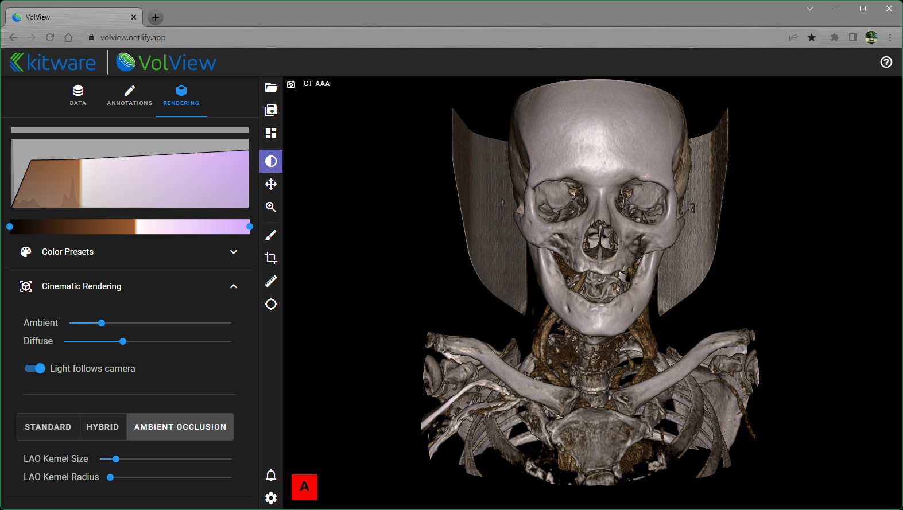
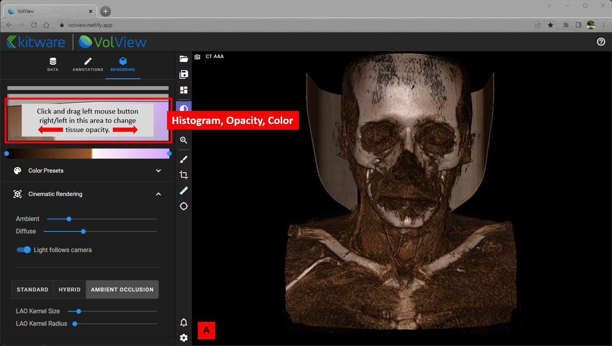
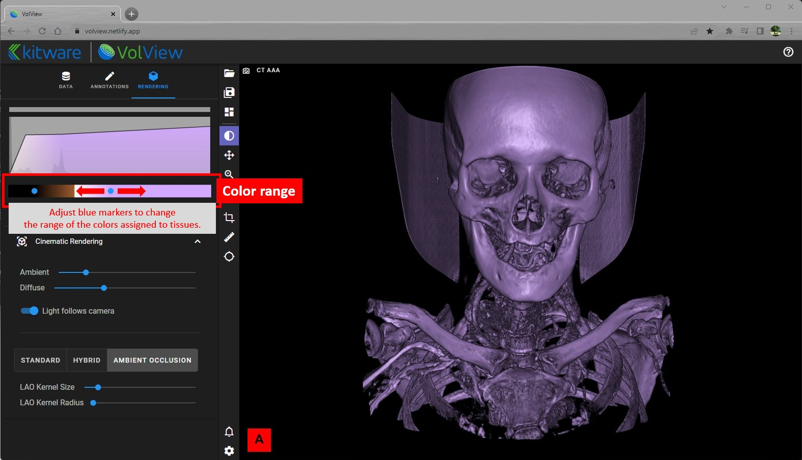
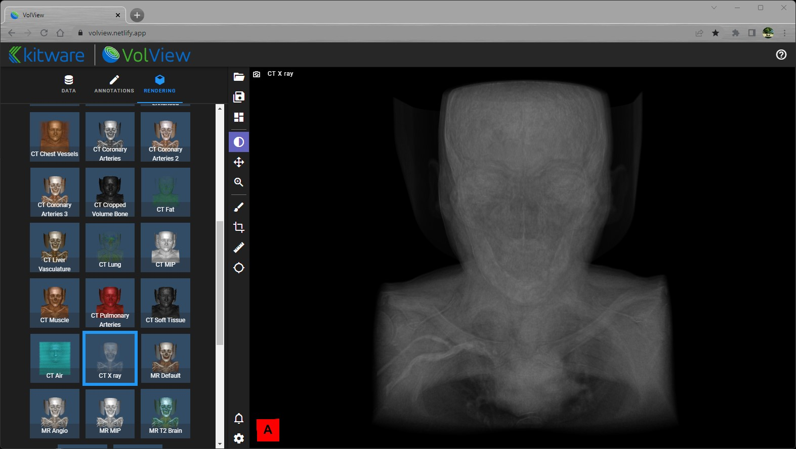
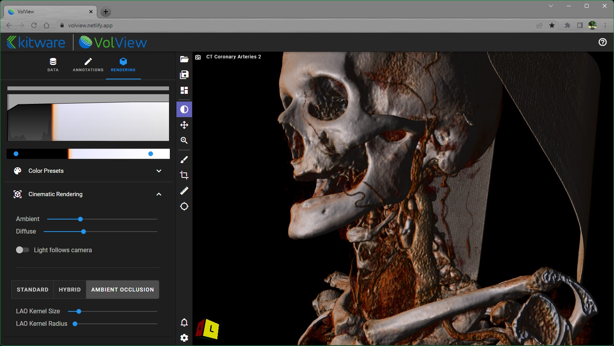

# Cinematic Volume Rendering

VolView reads the DICOM tags of your data to determine appropriate preset parameter values for cinematic volume rendering for your data, but often you will want to tweak those presets to emphasize specific details. Rendering controls apply to the currently selected/active view. We recommend the following sequence of tweaks to improve your visualizations.

1. Cinematic volume rendering involves two "transfer functions": one maps the recorded intensity values (e.g., CT hounsfield units) to opacity and the other maps recorded intensity values to color. Both can be adjusted using the controls at the top of the Rendering tab. The graph at the top shows a histogram of the recorded intensity values in light gray and the current opacity transfer function as an overlaid curve in black. In that graph, beneath the black curve, is a depiction of the color transfer function. 

   1. Begin by adjusting the opacity transfer function by a press-and-drag right/left on the top graph. 
   2. Then adjust the color transfer function by moving the blue dots on the colorbar beneath the graph. 

2. You may decide that the colormaps and/or transfer function aren't suitable for your data. Click on the "Presets" bar to expand and show the available presets that offer alternative opacity and color transfer functions. 
   [**_Watch the video!_**](https://youtu.be/eyrGd-meg6I)

3. Next, the lighting can be controlled.

   1. Ambient lighting is the general brightness of the scene.
   2. Diffuse lighting controls how the light reflects off the data. It is influenced by the position of the light relative to the orientation of the data's local surface.
   3. Light-follows-camera can be enabled / disabled to create shadows that highlights details within the data. When enabled, the light will be positioned in-line with the camera. When disabled, the last position of the light stays fixed relative to the data, even if the camera is moved. With light-follows-camera enabled, here is a view when the light is following the camera: . By moving the camera (and thereby the light) to the front of the data and then disabling light-follows-camera, the view should look light this: . Then moving back to the side view will show shadows that emphasize depth and details: .

4. Advanced, you can also explore alternative cinematic rendering methods.
   1. Standard
   2. Hybrid
   3. Ambient Occlusion
