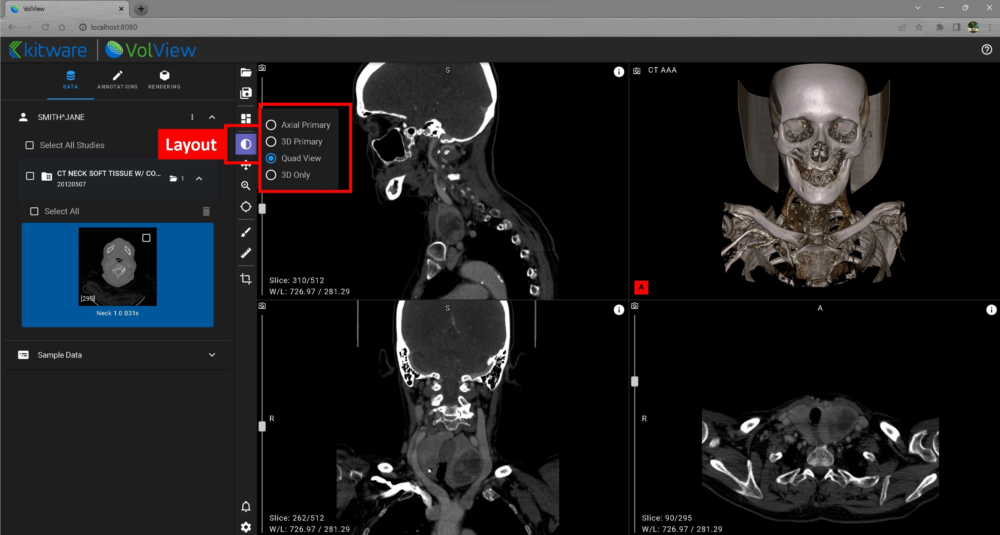
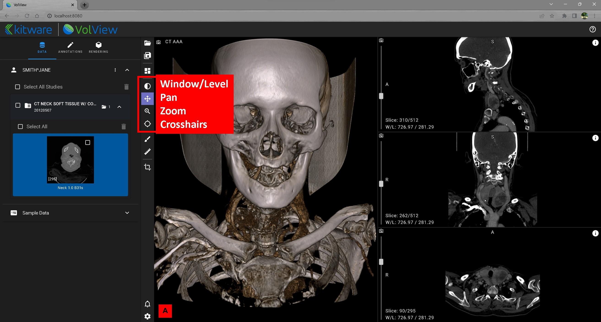
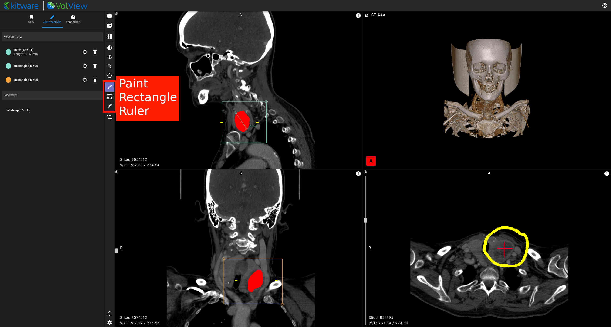
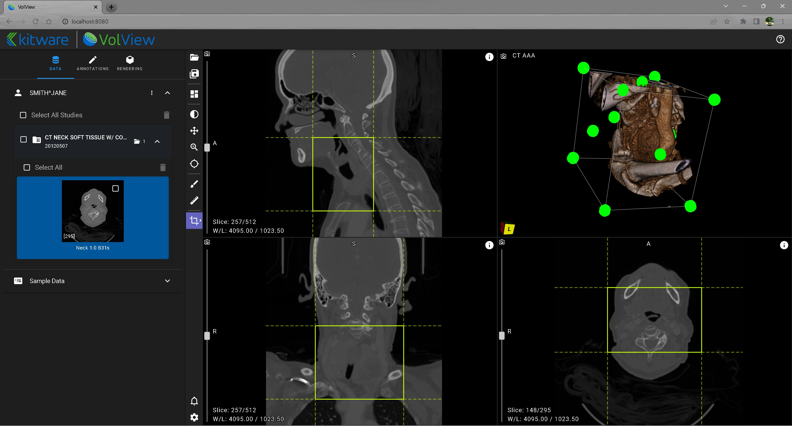

# Toolbar

## Layout

Use the layout button to choose between window arrangements. Each view can display a different dataset. Use the view type switcher dropdown in each view to change between 2D slice, 3D volume, or oblique views. Double-click a view to maximize it.



## 2D View left mouse button

Window / Level, Pan, Zoom, or Crosshairs: Select these options to control the function of the left mouse button in the 2D windows.



## 2D Annotations

The "Annotations" tab lists segments shared by paint, rectangles, polygons and rulers.
Select a segment in the list, use `q` and `w` to cycle through segments, or press `1`
through `0` to select one of the first ten (each row shows its key). Use "New segment"
to add one, and its color dot or edit button to change its name and appearance. Drag a
row, or press Alt+Up or Alt+Down, to reorder segments and their keys. The selection
applies across all four tools and images.

Each segment row has Reveal, Edit, Lock, Hide and Delete buttons. Reveal jumps to the
segment's mask or shapes on the current image and stays disabled when it has none
there. A locked segment keeps its voxels when another segment paints over it, and
cannot be edited or deleted until it is unlocked. Delete removes the segment with its
masks and shapes from every image. The buttons beside the "Segments" heading lock or
hide every segment at once and save the current image's segments. Saving writes one
file, or several bundled into a zip when segments overlap or number more than 65535.

The "Display" section sets Fill Opacity, Outline Opacity and Outline Thickness for the
segments on the current image, scaling each segment's own opacities.

The "Measurements" section lists the rectangles, polygons and rulers on the current
image. Each row shows its segment's color (click it to move the shape to another
segment), its placement and, for a ruler, its length, with Reveal, Hide and Delete
buttons. Select rows to hide or delete several at once.

### Paint

When the paint tool is selected, you can paint in any supported 2D slice window.
Choose the segment in "Annotations" and use the Paint controls below the segment
list to adjust brush size, switch to erasing, or set an intensity threshold.
Painting adds a mask for the selected segment on the image being painted. The
Eyedropper selects the segment under the brush when you click; hold `d` to use it
while painting. "Sync Views" moves the other 2D views to the slice under the brush.
The "Process" panel runs Fill Holes, Fill Between and Smooth, which never take voxels
another segment holds.

### Rectangle

When the rectangle tool is selected, the left mouse button is used to place and adjust rectangle control points.
Right click a rectangle control point to delete the rectangle.
The Measurements section in "Annotations" lists the rectangles on the current image, with Reveal, Hide and Delete controls.

New rectangles use the selected segment from "Annotations".

### Polygon

With the polygon tool selected:

- Place points: left mouse button.
- Remove last placed point: right mouse button.
- Remove all points: `Esc` key.
- Close a polygon after placing 3 points: Click first point, press `Enter` key or double click left mouse.

After closing a polygon:

- Move point: Drag point with left mouse button.
- Add point: Left mouse button on polygon line.
- Delete point: right click point and select Delete Point.
- Delete polygon: right click point or line and select Delete Polygon.

New polygons use the selected segment from "Annotations".

### Ruler

When the ruler tool is selected, the left mouse button places and adjusts ruler
end-markers. Right clicking an end-marker displays a menu for deleting that ruler.
Find it under Measurements in "Annotations" to see its length, jump to its slice or
cine frame, or delete it.

New rulers use the selected segment from "Annotations".



### Segment configuration

If VolView loads a JSON file matching the schema below, segments are added to the
registry. Paint, rectangles, polygons and rulers all share `segments`. Appearance
fields are optional. See [segment configuration](./configuration_file.md#segments)
for replacement behavior and how omitted fields use session appearance or defaults.

```json
{
  "segments": {
    "innocuous": { "color": "white" },
    "lesion": { "color": "#ff0000" },
    "tumor": { "color": "green", "strokeWidth": 3 }
  }
}
```

## 3D Crop

Select this tool to adjust the extent of data shown in the 3D rendering. In the 3D window you can pick and move the corner, edge, and side markers to make adjustments. In the 2D windows, grab and move the edges of the bounding box overlaid on the data.



[**_Watch the video!_**](https://youtu.be/Bj4ijh_VLUQ)
