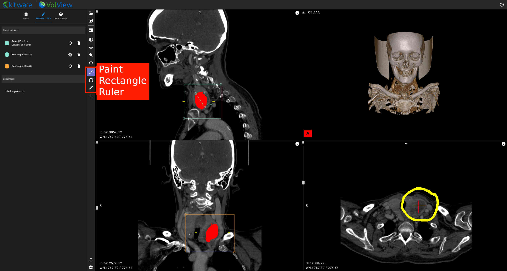

# Toolbar

## Layout

Use the layout button to choose between window arrangements. Each view can display a different dataset. Use the view type switcher dropdown in each view to change between 2D slice, 3D volume, or oblique views. Double-click a view to maximize it.


## 2D View left mouse button

Window / Level, Pan, Zoom, or Crosshairs: Select these options to control the function of the left mouse button in the 2D windows.


## 2D Annotations

The "Annotations" tab lists the drawn, vector based, annotation tools. Each tool in the list has a "scroll to slice" and delete button.

### Paint

When the paint tool is selected, you can paint in any 2D window. Click on the paint tool a second time to bring up a menu of colors and adjust the brush size. Painting automatically switches to the appropriate segment group for the volume being painted.

### Rectangle

When the rectangle tool is selected, the left mouse button is used to place and adjust rectangle control points.
Right click a rectangle control point to delete the rectangle.
The "Annotations" tab lists all rectangles and provides jump-to and delete controls.

Rectangle annotations can be tagged with a label. Use the palette in the upper left or the `q` or `w` keys to select the active label.

### Polygon

With the polygon tool selected:

- Place points: left mouse button.
- Remove last placed point: right mouse button.
- Remove all points: `Esc` key.
- Close a polygon after placing 3 points: Click first point, press `Enter` key or double click left mouse.

After closing a polygon:

- Move point: Drag point with left mouse button.
- Add point: Left mouse button on polygon line.
- Delete point: right click point and select Delete Point.
- Delete polygon: right click point or line and select Delete Polygon.

Polygon annotations can be tagged with a label. Use the palette in the upper left or the `q` or `w` keys to select the active label.

### Ruler

When the ruler tool selected, the left mouse button is used to place and adjust ruler end-markers. Right clicking on a end-marker displays a pop-up menu for deleting that ruler. Switch to the "Annotations" tab to see a list of annotations made to currently loaded data. Select the location icon next to a listed ruler to jump to its slice. Select the trashcan to delete that ruler.

Ruler annotations can be tagged with a label. Use the palette in the upper left or the `q` or `w` keys to select the active label.



### Label Configuration

If VolView loads a JSON file matching the schemas below, labels are added to the 2D annotation tools.
Example configuration JSON:

```json
{
  "labels": {
    "rulerLabels": {
      "big": { "color": "#ff0000" },
      "small": { "color": "white" }
    },
    "rectangleLabels": {
      "innocuous": { "color": "white", "fillColor": "#00ff0030" },
      "lesion": { "color": "#ff0000", "fillColor": "transparent" },
      "tumor": { "color": "green", "fillColor": "transparent" }
    }
  }
}
```

Label sections could be null to disable labels for a tool.

```json
{
  "labels": {
    "rulerLabels": null,
    "rectangleLabels": {
      "innocuous": {
        "color": "white",
        "fillColor": "#00ff0030"
      },
      "lesion": {
        "color": "#ff0000",
        "fillColor": "transparent"
      }
    }
  }
}
```

Tools will fallback to `defaultLabels` section if the tool has no specific labels property,
ie `rectangleLabels` or `rulerLabels`.

```json
{
  "labels": {
    "defaultLabels": {
      "artifact": { "color": "gray" },
      "needs-review": { "color": "#FFBF00" }
    }
  }
}
```

## 3D Crop

Select this tool to adjust the extent of data shown in the 3D rendering. In the 3D window you can pick and move the corner, edge, and side markers to make adjustments. In the 2D windows, grab and move the edges of the bounding box overlaid on the data.


[**_Watch the video!_**](https://youtu.be/Bj4ijh_VLUQ)
