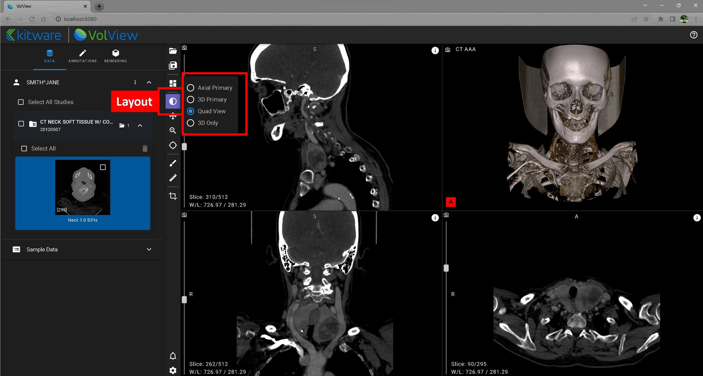

title: Toolbar
----

The three main radiological controls are as following:

* Layout: This toolbar button is illustrated below. Use it to choose between four useful window arrangements.  As in all things, if you have a particular layout that you would like to see added, please make a feature request on our ["issue tracker"](https://github.com/Kitware/VolView/issues).  

* 2D Left mouse button: Window / Level, Pan, Zoom, or Crosshairs: Select these options to control the function of the left mouse button in the 2D windows.  

* 2D Annotations: Paint and Ruler: When the ruler tool selected, the left mouse button is used to place and adjust ruler end-markers.  Right clicking on a end-marker displays a pop-up menu for deleting that ruler.  Switch to the "Annotations" tab to see a list of annotations made to currently loaded data.  Select the location icon next to a listed ruler to jump to its slice.  Select the trashcan to delete that ruler.  When the paint tool is selected, you can paint in any 2D window.  Click on the paint tool a second time to bring up a menu of colors and adjust the brush size. 

* 3D Crop: Select this tool to adjust the extent of data shown in the 3D rendering.  In the 3D window you can pick and move the corner, edge, and side markers to make adjustments.  In the 2D windows, grab and move the edges of the bounding box overlaid on the data. 

[***Watch the video!***](https://youtu.be/Bj4ijh_VLUQ)
